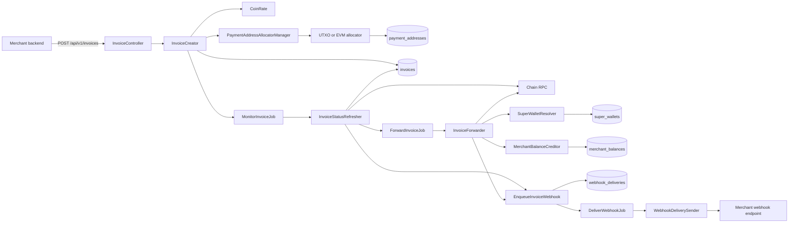

# Crypto Payment Gateway

Laravel 12 application for issuing crypto invoices, tracking incoming payments, settling merchant funds, and delivering invoice webhooks. The project includes:

- merchant API for invoice creation and status lookup;
- hosted invoice page for end customers;
- merchant portal for wallets, balances, API keys, invoices, and webhooks;
- admin portal for operational control;
- queue-driven monitoring, forwarding, and webhook delivery;
- multi-asset support with a registry-based architecture.

## What The System Does

The main use case is:

1. A merchant calls the API and creates an invoice in USD.
2. The gateway snapshots the exchange rate, calculates the crypto amount, allocates a deposit address, and stores the invoice.
3. A background job polls the blockchain until the invoice becomes `fixated`, `paid`, or `expired`.
4. After payment confirmation, the gateway either:
   - forwards the merchant net amount to a configured destination wallet;
   - or credits an internal merchant balance if no destination wallet exists.
5. State changes are pushed to the merchant via signed webhooks.

## Current Status

Production-ready flow in this repository is centered around UTXO chains:

- `btc`
- `ltc`
- `dash`

There is also early EVM groundwork:

- `eth_local` asset on `evm_local`
- EVM address derivation support for local/testing
- EVM RPC client and chain driver

EVM monitoring and settlement are not fully implemented yet, so treat that part as work in progress.

## Architecture In One Diagram

The repo now contains a browser-friendly architecture page:

- start the app;
- open `/architecture`;
- or read the Mermaid diagram below in a Markdown renderer that supports Mermaid.



## Main Building Blocks

### Backend

- `app/Services/InvoiceCreator.php` creates invoices, snapshots exchange rate, allocates payment addresses, and schedules monitoring.
- `app/Services/InvoiceStatusRefresher.php` re-reads chain state and moves invoices through `pending -> fixated -> paid` or `pending -> expired`.
- `app/Services/InvoiceForwarder.php` settles paid invoices by forwarding to a wallet or crediting internal balance.
- `app/Services/Webhooks/*` builds, signs, stores, retries, and delivers outbound webhooks.
- `app/Services/PaymentAddresses/*` selects address allocation strategy by network family.
- `app/Support/Assets/AssetRegistry.php` and `app/Support/Chains/ChainRegistry.php` describe supported assets and networks.
- `app/Support/Chains/ChainManager.php` resolves the correct RPC driver.

### Frontend

Vue 3 portals live in `resources/js`:

- merchant portal under `resources/js/pages/merchant`;
- admin portal under `resources/js/pages/admin`;
- router files in `resources/js/router`;
- auth state in `resources/js/stores`.

Blade is used for:

- hosted invoice page;
- SPA entry views for `/merchant/*` and `/admin/*`;
- architecture page at `/architecture`.

### Queue Jobs

- `MonitorInvoiceJob` polls invoice state until terminal status.
- `ForwardInvoiceJob` performs settlement after payment confirmation.
- `DeliverWebhookJob` sends one stored webhook delivery attempt.

## Domain Model

### Core entities

- `Merchant`: invoice owner, fee configuration, webhook settings, portal umbrella.
- `MerchantApiKey`: bearer token hash for merchant API access.
- `MerchantUser`: session-authenticated portal user with RBAC role.
- `Invoice`: payment state snapshot and settlement state machine.
- `PaymentAddress`: deposit address allocated per invoice.
- `SuperWallet`: settlement destination wallet, merchant-specific or global fallback.
- `MerchantBalance`: internal balance used when no forwarding wallet is available.
- `WebhookDelivery`: persisted outbound webhook with retries.
- `Role`, `Capability`: RBAC for merchant portal actions.
- `AdminUser`: admin portal session user.

### Important invoice fields

- `status`: `pending`, `fixated`, `paid`, `expired`
- `forward_status`: `none`, `processing`, `partial`, `done`, `failed`
- `amount_coin`, `expected_usd`, `rate_usd`
- `received_all_coin`, `received_conf_coin`
- `paid_at`, `fixated_at`, `expires_at`
- `forwarded_coin`, `forward_txids`

## Supported Access Modes

### Merchant API

Token-based access through `Authorization: Bearer <token>`.

Key endpoints:

- `POST /api/v1/invoices`
- `GET /api/v1/invoices/{id}`
- `POST /api/v1/invoices/{id}/refresh`

Middleware:

- `auth.merchant` via `App\Http\Middleware\AuthMerchantApiKey`

### Merchant Portal

Session-based auth for merchant users.

Main sections:

- dashboard
- invoices
- balances
- wallets
- webhook settings
- webhook deliveries
- API keys

Access control is capability-based through `merchant.capability`.

### Admin Portal

Session-based auth for admin users.

Main sections:

- dashboard
- merchants
- merchant users
- invoices
- webhook deliveries
- merchant API keys

### Hosted Invoice

Public customer-facing page:

- `GET /i/{publicId}`
- `GET /i/{publicId}/status`

## Address Allocation

The address layer is family-aware:

- UTXO networks use `UtxoPaymentAddressAllocator`, which asks the coin RPC node for a new address and stores it in `payment_addresses`.
- EVM networks use `EvmPaymentAddressAllocator`, which reserves a derivation index and derives an address through an EVM-specific deriver.

For EVM local/testing, `DevRpcAccountAddressDeriver` can temporarily source addresses from `eth_accounts` on Anvil. This is explicitly a dev-only shortcut, not a production custody model.

## Settlement Logic

When an invoice becomes `paid`:

1. `InvoiceStatusRefresher` checks whether there is still merchant net amount left to settle.
2. `ForwardInvoiceJob` dispatches if settlement is needed and forwarding is enabled.
3. `InvoiceForwarder` resolves a merchant-specific or global `SuperWallet`.
4. If a wallet exists, funds are sent on-chain via coin RPC.
5. If no wallet exists, `MerchantBalanceCreditor` books the merchant payout into `merchant_balances`.
6. `invoice.forwarded` webhook is enqueued after successful settlement booking.

Merchant payout is based on confirmed amount minus merchant fee percent.

## Webhook Lifecycle

Configured per merchant:

- `webhook_url`
- `webhook_secret`

Flow:

1. State change happens.
2. `EnqueueInvoiceWebhook` stores a `webhook_deliveries` row.
3. `DeliverWebhookJob` runs asynchronously.
4. `WebhookDeliverySender` performs the HTTP request with signature headers.
5. Failures are retried with backoff until `max_attempts`.

Headers include:

- `X-Webhook-Signature`
- `X-Webhook-Event`
- `X-Webhook-Delivery-Id`

## Project Structure

```text
app/
  Console/Commands/        maintenance and backfill commands
  Http/Controllers/        API, hosted page, admin and merchant portal controllers
  Http/Middleware/         API key auth, portal auth, merchant capability checks
  Http/Requests/           request validation
  Http/Resources/          admin dashboard resource
  Jobs/                    queue jobs for monitoring, forwarding, webhooks
  Models/                  domain entities
  Services/                business logic
  Support/                 asset and chain registries
config/
  assets.php               asset registry
  chains.php               chain registry
  payments.php             invoice TTL, confirmations, polling config
  forwarding.php           settlement forwarding thresholds
  webhooks.php             webhook timeouts and retry policy
  payment_addresses.php    EVM derivation config
database/
  migrations/              schema
  seeders/                 RBAC bootstrap and admin seeding
resources/
  js/                      Vue portals
  views/                   Blade entrypoints and hosted invoice page
routes/
  api.php                  all JSON endpoints
  web.php                  hosted pages, SPAs, architecture page
tests/
  Feature/                 HTTP/API tests
  Unit/                    service and webhook tests
  Integration/             real RPC smoke tests
```

## Local Development

### Fast local mode

This mode is enough to understand the system and run most tests.

```bash
cp .env.example .env
composer install
npm install
mkdir -p database
touch database/database.sqlite
php artisan key:generate
php artisan migrate
php artisan db:seed
php artisan db:seed --class=AdminUserSeeder
npm run dev
php artisan serve
php artisan queue:listen --tries=1 --timeout=0
```

Recommended local config:

- `DB_CONNECTION=sqlite`
- `QUEUE_CONNECTION=database`
- `SESSION_DRIVER=database`
- `COIN_RPC_MODE=mock`
- `FORWARDING_ENABLED=false` for safe dry runs

### Full local infrastructure

`compose.yaml` includes:

- Laravel Sail container
- PostgreSQL
- Redis
- Bitcoin Core
- Litecoin Core
- Dash Core
- Anvil for local EVM

If you want the full stack, bring up the services you actually need and switch `COIN_RPC_MODE=real`.

## Admin Bootstrap

Admin bootstrap values come from config:

- `ADMIN_BOOTSTRAP_NAME`
- `ADMIN_BOOTSTRAP_EMAIL`
- `ADMIN_BOOTSTRAP_PASSWORD`

The admin user is seeded by:

```bash
php artisan db:seed --class=AdminUserSeeder
```

Portal URLs:

- merchant portal: `/merchant`
- admin portal: `/admin`
- architecture page: `/architecture`

## Testing

Useful commands from `composer.json`:

```bash
composer test
composer test:fast
composer test:integration
composer test:all
```

Coverage focus in the existing suite:

- invoice API auth and idempotency
- status refresh transitions
- settlement forwarding and internal balance fallback
- webhook delivery success and retry behavior
- optional real RPC smoke checks

Integration tests require:

- `RUN_REAL_RPC_TESTS=true`
- `COIN_RPC_MODE=real`
- reachable chain nodes

## Known Limitations And Notes

- EVM support is partial; the repository contains scaffolding, not a complete production settlement flow.
- Queue worker is mandatory for realistic behavior because monitoring, forwarding, and webhook delivery are async.
- Merchant API auth uses hashed custom API keys, not Sanctum personal access tokens.
- There are test webhook endpoints in `routes/api.php`; they are marked as temporary.
- Some legacy `coin` fields still coexist with newer `asset_key` and `network_key` fields, and the repo includes a backfill command for that migration path.

## Useful Entry Points For Reading The Code

If you want to read the project in the right order, start here:

1. `routes/api.php`
2. `app/Http/Controllers/Api/InvoiceController.php`
3. `app/Services/InvoiceCreator.php`
4. `app/Jobs/MonitorInvoiceJob.php`
5. `app/Services/InvoiceStatusRefresher.php`
6. `app/Jobs/ForwardInvoiceJob.php`
7. `app/Services/InvoiceForwarder.php`
8. `app/Services/Webhooks/EnqueueInvoiceWebhook.php`
9. `app/Services/Webhooks/WebhookDeliverySender.php`
10. `app/Models/Invoice.php`

That sequence follows the real business lifecycle of one invoice.
