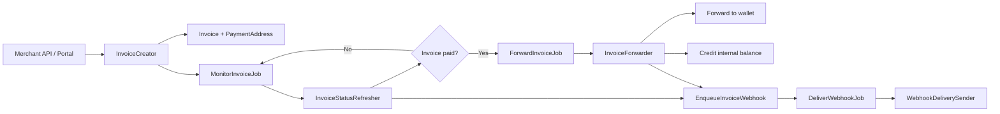
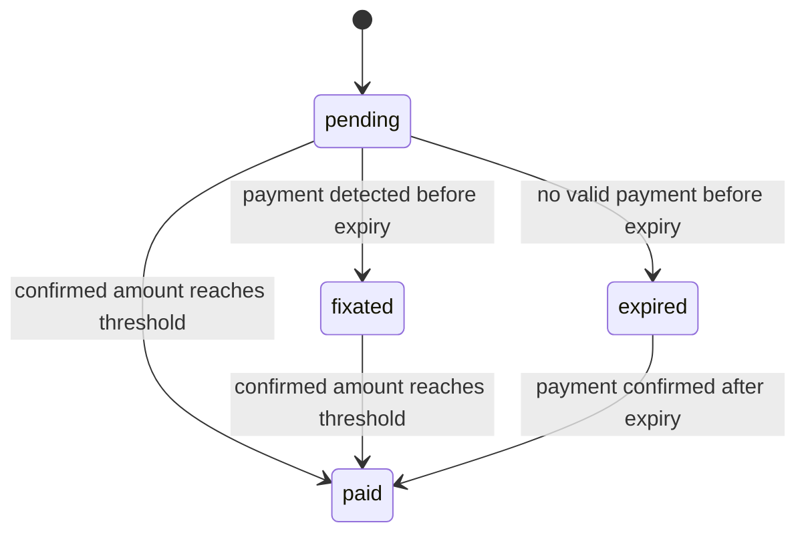

# Settlane

**Portfolio MVP for a multi-asset invoice and settlement gateway**

Settlane is a Laravel + Vue project that models the backend workflow of a payment gateway: merchant APIs, invoice creation, deposit address allocation, asynchronous payment monitoring, settlement, internal balance fallback, signed webhooks, and admin operations.

It is positioned as an employer-facing portfolio project for backend and platform roles in fintech, banking, crypto exchanges, iGaming, and payment infrastructure. It is not positioned as production-ready software for real funds.

## Quick Links

| Link | URL |
|---|---|
| Live demo | [Add demo URL](https://example.com) |
| GitHub profile | [Add GitHub profile](https://github.com/your-username) |

## Overview

This project models the operational flow of a gateway that accepts crypto-denominated payments for merchants while keeping the merchant-facing API in invoice terms:

- a merchant creates an invoice in USD terms
- the gateway snapshots a rate and computes the payable asset amount
- the system allocates a dedicated deposit address
- queue workers refresh invoice state from chain data
- paid invoices are either forwarded to a configured wallet or credited to an internal balance
- invoice state changes are delivered to merchant webhook endpoints with persisted delivery history

The repository includes:

- merchant API endpoints for invoice operations
- merchant and admin web portals
- public hosted invoice pages
- queue-driven invoice monitoring, settlement, and webhook delivery
- UTXO support for `btc`, `ltc`, and `dash`
- local/dev EVM support for `eth_local` and `eth_usdt_local`

## What Problem It Models

Settlane models the backend concerns of a transactional payment system:

- translating merchant invoice intent into chain-specific payment instructions
- tracking an invoice through multiple state transitions
- isolating deposit addresses per invoice
- separating payment detection from settlement
- handling payout fallback when no forwarding wallet is configured
- exposing operational visibility to merchant and admin users
- persisting and retrying outbound webhooks

## Implemented Features

### Core payment flow

- Merchant API key authentication for `/api/v1` invoice endpoints.
- Invoice creation with:
  - merchant-scoped idempotency by `external_id`
  - USD rate snapshotting
  - asset/network resolution
  - dedicated payment address allocation
  - hosted invoice URL generation
  - monitor job dispatch
- Invoice state refresh with transitions:
  - `pending`
  - `fixated`
  - `paid`
  - `expired`
- Public hosted invoice page and polling endpoint by `public_id`.

### Address allocation

- UTXO address allocation via node RPC `getnewaddress`.
- EVM address allocation persisted in `payment_addresses`.
- EVM derivation index tracking through `payment_address_cursors`.
- Address-to-invoice linkage with assigned status and metadata.

### Settlement

- Net settlement after merchant fee deduction.
- Forwarding to merchant-specific or global destination wallet when configured.
- Internal balance credit fallback when no forwarding wallet exists.
- Forwarding status tracking on invoices.
- EVM-native payout path.
- Local ERC-20 payout path with gas pre-check and gas top-up deferral logic.

### Webhooks

- Signed outbound invoice webhooks using HMAC SHA-256.
- Persisted webhook delivery records.
- Async delivery via queued job.
- Retry scheduling with stored attempt/error metadata.
- Merchant and admin visibility into delivery history.
- Admin manual retry endpoint.

### Merchant operations

- Merchant portal login/logout/me flow.
- Merchant portal pages for:
  - dashboard
  - invoices list and detail
  - balances
  - wallets
  - webhook settings
  - webhook deliveries
  - API keys
  - create test invoice
- Merchant RBAC model with roles and capabilities enforced on portal routes.

### Admin operations

- Admin portal login/logout/me flow.
- Admin portal pages for:
  - dashboard
  - merchants
  - merchant detail
  - merchant users
  - invoices
  - webhook deliveries
  - merchant API key metadata
- Admin merchant creation.
- Admin merchant wallet CRUD.
- Admin merchant user create / role update / status update.
- Admin invoice refresh endpoint.

## Supported Assets and Networks

| Asset key | Network key | Chain family | Asset type | Status in repo |
|---|---|---|---|---|
| `btc` | `bitcoin` | UTXO | Native | Implemented |
| `ltc` | `litecoin` | UTXO | Native | Implemented |
| `dash` | `dash` | UTXO | Native | Implemented |
| `eth_local` | `evm_local` | EVM | Native | Implemented for local/dev setup |
| `eth_usdt_local` | `evm_local` | EVM | ERC-20 token | Implemented for local/dev setup |

## Architecture Overview

Settlane uses a single Laravel backend for API routes, hosted invoice pages, queue workers, and both operator portals.

### Main backend components

| Component | Responsibility |
|---|---|
| `InvoiceCreator` | Creates invoices, snapshots rate, allocates payment address, schedules monitoring |
| `MonitorInvoiceJob` | Re-dispatching monitor loop for active invoices |
| `InvoiceStatusRefresher` | Reads chain state and applies invoice transitions |
| `ForwardInvoiceJob` | Async settlement trigger |
| `InvoiceForwarder` | Resolves settlement destination and executes forwarding or fallback credit |
| `MerchantBalanceCreditor` | Credits internal merchant balances when no wallet is configured |
| `EnqueueInvoiceWebhook` | Persists outgoing webhook deliveries |
| `DeliverWebhookJob` | Async webhook delivery trigger |
| `WebhookDeliverySender` | Executes webhook HTTP delivery and retry scheduling |
| `PaymentAddressAllocatorManager` | Chooses UTXO vs EVM allocation strategy |
| `ChainManager` / `ChainRegistry` | Resolves chain drivers and chain metadata |
| `AssetRegistry` | Central asset catalog for asset/network metadata |

### Persistence model

Key tables and models:

- `merchants`
- `merchant_users`
- `roles`
- `capabilities`
- `merchant_api_keys`
- `invoices`
- `payment_addresses`
- `super_wallets`
- `merchant_balances`
- `webhook_deliveries`
- `evm_gas_fundings`

### High-level system flow



## Payment / Invoice Lifecycle



### Settlement behavior after `paid`

1. The system calculates the merchant net amount after fee deduction.
2. If a merchant-specific or global forwarding wallet exists for the asset/network, Settlane attempts on-chain forwarding.
3. If no forwarding wallet exists, Settlane credits `merchant_balances` instead.
4. Settlement completion triggers `invoice.forwarded` webhook enqueueing.

## Backend Reliability Features

- Queue-backed monitoring, settlement, and webhook delivery.
- Invoice idempotency by `merchant_id + external_id`.
- DB transaction boundaries around status refresh and settlement reservation/finalization.
- Per-invoice forwarding attempt UUID tracking.
- Persisted webhook delivery attempts, statuses, timestamps, and errors.
- Merchant balance fallback when forwarding destination is absent.
- Separate payment address records rather than relying only on invoice rows.
- Real-RPC integration tests for UTXO forwarding flows.

## Tech Stack

| Layer | Stack |
|---|---|
| Backend | PHP 8.2, Laravel 12 |
| Frontend | Vue 3, Vue Router, Pinia, Vite |
| Database | PostgreSQL |
| Queue/cache | Database queue, Redis |
| Auth | Session guards for portals, hashed merchant API keys for `/api/v1` |
| Testing | PHPUnit feature, unit, and integration tests |
| Local infra | Laravel Sail, Docker Compose, regtest UTXO nodes, Anvil |

## Local Setup

### Requirements

- PHP 8.2
- Composer
- Node.js + npm
- PostgreSQL
- Redis
- Docker / Docker Compose for the included local node stack

### Environment notes

- `.env.example` defaults to `COIN_RPC_MODE=real`, which expects local chain nodes to be available.
- Merchant/admin portal usage requires seeded RBAC data and an admin user.
- Local EVM flows require additional mnemonic/key-ref configuration because the default env leaves local HD secret material blank.

### Bootstrapping

Install dependencies and create the app env:

```bash
cp .env.example .env
composer install
npm install
```

Generate the app key and run migrations:

```bash
php artisan key:generate
php artisan migrate --force
```

Seed merchant roles/capabilities and create the admin bootstrap user:

```bash
php artisan db:seed
php artisan db:seed --class=AdminUserSeeder
```

Build frontend assets:

```bash
npm run build
```

### Running locally

Full local dev process:

```bash
composer dev
```

Frontend-only:

```bash
npm run dev
```

### Docker / local node stack

`compose.yaml` includes:

- Laravel Sail app container
- PostgreSQL
- Redis
- Bitcoin regtest node
- Litecoin regtest node
- Dash regtest node
- Anvil local EVM node

## Demo Flows

### Flow 1: Merchant invoice lifecycle

1. Seed roles and create the admin bootstrap user.
2. Log in to the admin portal.
3. Create a merchant.
4. Create a merchant user.
5. Log in to the merchant portal.
6. Configure a forwarding wallet.
7. Create an API key or use the portal test-invoice page.
8. Create an invoice.
9. Open the hosted invoice page.
10. Pay the deposit address in the local demo environment.
11. Observe status progression: `pending -> fixated -> paid`.

### Flow 2: Settlement forwarding

1. Configure a forwarding wallet for the merchant or global scope.
2. Pay a test invoice.
3. Observe `forward_status` and forwarding tx IDs on the invoice detail page.
4. Verify settlement behavior in admin and merchant views.

### Flow 3: Internal balance fallback

1. Remove or skip wallet configuration.
2. Pay a test invoice.
3. Observe merchant balance credit in `merchant_balances`.

### Flow 4: Webhook delivery and retry

1. Configure merchant webhook URL and secret.
2. Trigger invoice events through payment state changes.
3. Inspect webhook delivery records in merchant or admin portal.
4. Retry a failed delivery from the admin portal.

## Testing

| Command | Purpose |
|---|---|
| `composer test` | Default Laravel test run |
| `composer test:fast` | Feature/API + core service/webhook coverage |
| `composer test:integration` | Real-RPC integration tests |
| `composer test:all` | Fast tests plus integration tests |
| `npm run build` | Frontend production build |

## Screenshots

Placeholder section:

- Merchant dashboard
- Merchant invoice detail
- Hosted invoice page
- Admin merchant detail
- Admin webhook delivery detail

## What This Project Demonstrates

For backend team leads and hiring managers, this project demonstrates:

- service-oriented Laravel application design for transactional workflows
- separation of invoice creation, monitoring, settlement, and notification concerns
- queue-driven reliability patterns instead of synchronous request-bound processing
- multi-asset and multi-network abstraction using registries and family-aware services
- operational modeling around idempotency, retries, settlement fallback, and status visibility
- practical admin tooling for merchants, wallets, invoice inspection, and webhook debugging
- an implementation style that is closer to payment infrastructure than to a CRUD demo

## Portfolio / Demo Scope Note

Settlane should be evaluated as a portfolio MVP that demonstrates backend architecture for payment and settlement systems.

It is intentionally useful as a code sample for:

- payment gateway orchestration
- invoice lifecycle handling
- wallet allocation
- settlement bookkeeping
- webhook delivery pipelines
- operator-facing admin tooling

It should not be evaluated as a claim of production readiness for custody or real-money operations.

## What This Project Is Not

- Not a production-ready gateway for real funds.
- Not a complete custody platform or audited wallet/signing system.
- Not a hardened compliance, treasury, or reconciliation platform.
- Not full mainnet EVM support; current EVM support is local/dev-oriented.
- Not a claim of complete admin authorization; admin roles exist in data but route-level role enforcement is not implemented.
- Not a browser E2E-tested product.

## Current Scope Notes

- Merchant API routes are implemented under `/api/v1`.
- Merchant and admin portals are implemented as separate Vue apps.
- Hosted invoices are implemented at `/i/{publicId}`.
- UTXO support is the strongest end-to-end path in the repository today.
- EVM support is implemented but should be presented as local/demo scope rather than production custody architecture.
