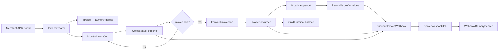
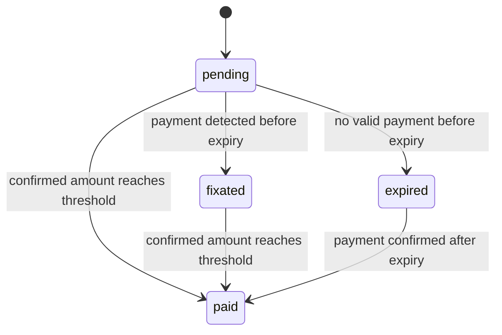

# Settlane

**Portfolio MVP for a multi-asset invoice and settlement gateway**

Settlane is a Laravel + Vue project that models the backend workflow of a payment gateway: merchant APIs, invoice creation, deposit address allocation, asynchronous payment monitoring, policy-controlled settlement, signed webhooks, and admin operations.

It is positioned as an employer-facing backend/platform portfolio project for fintech, banking, crypto exchanges, iGaming, and payment infrastructure. It is close to a product-shaped MVP, but it should still be evaluated as a demo system rather than an audited production gateway for real funds.

## Quick Links

| Link | URL |
|---|---|
| Live demo | [settlane.tech](https://settlane.tech) |
| GitHub profile | [AndrewGalak6578](https://github.com/AndrewGalak6578) |
| Merchant Portal v2 notes | [docs/MERCHANT_PORTAL_V2.md](docs/MERCHANT_PORTAL_V2.md) |
| Hosted checkout metadata | [docs/HOSTED_CHECKOUT_METADATA.md](docs/HOSTED_CHECKOUT_METADATA.md) |
| Verification checklist | [docs/MVP_VERIFICATION_CHECKLIST.md](docs/MVP_VERIFICATION_CHECKLIST.md) |

## Overview

This project models the operational flow of a gateway that accepts crypto-denominated payments for merchants while keeping the merchant-facing API in invoice terms:

- a merchant creates an invoice in USD terms
- the gateway snapshots a rate and computes the payable asset amount
- the system allocates a dedicated deposit address
- queue workers refresh invoice state from chain data
- paid invoices are forwarded, held by policy, or credited internally only when an explicit custodial policy selects that outcome
- invoice state changes are delivered to merchant webhook endpoints with persisted delivery history

The repository includes:

- merchant API endpoints for invoice operations
- Merchant Portal v2 and Admin Portal web interfaces
- public hosted checkout pages with payer asset selection
- queue-driven invoice monitoring, settlement, and webhook delivery
- UTXO support for `btc`, `ltc`, and `dash`
- local/dev EVM support for `eth_local` and `eth_usdt_local`

## What Problem It Models

Settlane models the backend concerns of a transactional payment system:

- translating merchant invoice intent into chain-specific payment instructions
- tracking an invoice through multiple state transitions
- isolating deposit addresses per invoice
- separating payment detection from settlement
- holding payouts safely when no merchant-owned forwarding wallet is configured
- exposing operational visibility to merchant and admin users
- persisting and retrying outbound webhooks

## Implemented Features

### Core payment flow

- Merchant API key authentication for `/api/v1` invoice endpoints.
- Invoice creation with:
  - merchant-scoped idempotency by `external_id`
  - USD rate snapshotting
  - asset/network resolution
  - dedicated payment address allocation
  - hosted invoice URL generation
  - monitor job dispatch
- Merchant Portal invoice creation with:
  - payer asset selection support
  - merchant checkout defaults
  - allowed asset restrictions
  - redirect URL metadata
  - min/max checkout amount controls
- Invoice state refresh with transitions:
  - `pending`
  - `fixated`
  - `paid`
  - `expired`
- Public hosted checkout page and polling endpoint by `public_id`.
- Hosted checkout states for asset selection, awaiting payment, partial/underpaid, confirming, paid, and expired.
- Expired checkout states hide QR/address/copy actions to prevent accidental payment.

### Address allocation

- UTXO address allocation via node RPC `getnewaddress`.
- EVM address allocation persisted in `payment_addresses`.
- EVM derivation index tracking through `payment_address_cursors`.
- Address-to-invoice linkage with assigned status and metadata.

### Settlement

- Net settlement after merchant fee deduction.
- Forwarding to merchant-owned destination wallets; platform custody fallback is separately configured and disabled by default.
- Explicit `immediate`, per-invoice `threshold`, `manual`, `internal_balance_only`, and `disabled` policy modes.
- Missing merchant destination wallets create non-retryable policy holds, not implicit custodial liabilities.
- Internal balance credit only when `internal_balance_only` is selected by admin policy.
- Forwarding status tracking on invoices.
- Settlement ledger entries for internal credits and forward-sent outcomes.
- Durable settlement attempts with confirmation-aware chain reconciliation.
- Durable EVM gas-funding records with chain-aware reconciliation and gas-station nonce serialization.
- Backfill command for older invoices based on `invoices.forward_txids` and balance-credit fields.
- EVM-native payout path.
- Local ERC-20 payout path with gas pre-check and gas top-up deferral logic.

### Webhooks

- Signed outbound invoice webhooks using HMAC SHA-256.
- Persisted webhook delivery records.
- Transactional `invoice.forwarded` outbox persistence with unique idempotency keys.
- Async delivery via queued job.
- Retry scheduling with stored attempt/error metadata.
- Merchant and admin visibility into delivery history.
- Admin manual retry endpoint.

### Merchant operations

- Merchant portal login/logout/me flow.
- Merchant Portal v2 pages for:
  - dashboard
  - payments list, filters, detail drawer, and full payment detail
  - create payment link
  - settlements, destination wallets, balances, wallet estimate, and settlement ledger
  - per-asset Settlement Rules with platform inheritance and optimistic revision handling
  - developer tools: API keys, webhook settings, webhook deliveries, test webhook signal, payload inspection, and retry
  - checkout/settings customization
  - team management
  - teammate dossier pages with activity timeline
- Merchant RBAC model with roles and capabilities enforced on portal routes.
- Merchant activity logging for auth, team, settings, developer, wallet, invoice, and settlement-related actions.
- Action metadata scrubbing for sensitive keys such as passwords, tokens, and webhook secrets.

### Admin operations

- Admin portal login/logout/me flow.
- Admin portal pages for:
  - dashboard
  - merchants
  - merchant detail
  - merchant users
  - invoices
  - webhook deliveries
  - merchant API key metadata
- Admin merchant creation.
- Admin merchant wallet CRUD.
- Admin merchant user create / role update / status update.
- Admin invoice refresh endpoint.

## Supported Assets and Networks

| Asset key | Network key | Chain family | Asset type | Status in repo |
|---|---|---|---|---|
| `btc` | `bitcoin` | UTXO | Native | Implemented |
| `ltc` | `litecoin` | UTXO | Native | Implemented |
| `dash` | `dash` | UTXO | Native | Implemented |
| `eth_local` | `evm_local` | EVM | Native | Implemented for local/dev setup |
| `eth_usdt_local` | `evm_local` | EVM | ERC-20 token | Implemented for local/dev setup |

## Architecture Overview

Settlane uses a single Laravel backend for API routes, hosted invoice pages, queue workers, and both operator portals.

### Main backend components

| Component | Responsibility |
|---|---|
| `InvoiceCreator` | Creates invoices, snapshots rate, allocates payment address, schedules monitoring |
| `MonitorInvoiceJob` | Re-dispatching monitor loop for active invoices |
| `InvoiceStatusRefresher` | Reads chain state and applies invoice transitions |
| `ForwardInvoiceJob` | Async settlement trigger |
| `InvoiceForwarder` | Atomically resolves policy/destination and persists a hold, explicit internal credit, or forwarding attempt |
| `SettlementAttemptReconciler` | Verifies broadcast identity and confirmations before accounting completion |
| `ReconcileSettlementAttemptJob` | Runs delayed, bounded reconciliation without rebroadcasting |
| `EvmGasFundingReconciler` | Verifies native gas-sponsorship identity, receipts, and confirmations |
| `ReconcileEvmGasFundingJob` | Runs delayed gas-funding reconciliation without resending ambiguous top-ups |
| `MerchantBalanceCreditor` | Credits internal merchant balances only when policy mode is `internal_balance_only` |
| `EnqueueInvoiceWebhook` | Persists idempotent outgoing webhook deliveries and dispatches only after commit |
| `DeliverWebhookJob` | Async webhook delivery trigger |
| `WebhookDeliverySender` | Executes webhook HTTP delivery and retry scheduling |
| `PaymentAddressAllocatorManager` | Chooses UTXO vs EVM allocation strategy |
| `ChainManager` / `ChainRegistry` | Resolves chain drivers and chain metadata |
| `AssetRegistry` | Central asset catalog for asset/network metadata |

### Persistence model

Key tables and models:

- `merchants`
- `merchant_users`
- `roles`
- `capabilities`
- `merchant_api_keys`
- `invoices`
- `payment_addresses`
- `super_wallets`
- `merchant_balances`
- `merchant_settlement_entries`
- `merchant_settlement_attempts`
- `custody_accounts`
- `custody_journal_entries`
- `custody_journal_postings`
- `custody_account_balances`
- `merchant_activity_logs`
- `webhook_deliveries`
- `evm_gas_fundings`

### High-level system flow


```mermaid
flowchart LR
    A[Merchant API / Portal] --> B[InvoiceCreator]
    B --> C[Invoice + PaymentAddress]
    B --> D[MonitorInvoiceJob]
    D --> E[InvoiceStatusRefresher]
    E --> F{Invoice paid?}
    F -- No --> D
    F -- Yes --> G[ForwardInvoiceJob]
    G --> H[InvoiceForwarder]
    H --> I[Broadcast payout]
    I --> N[Reconcile confirmations]
    N --> K
    H --> J[Credit internal balance]
    E --> K[EnqueueInvoiceWebhook]
    H --> K
    K --> L[DeliverWebhookJob]
    L --> M[WebhookDeliverySender]
```

## Payment / Invoice Lifecycle


```mermaid
stateDiagram-v2
    [*] --> pending
    pending --> fixated: payment detected before expiry
    pending --> expired: no valid payment before expiry
    pending --> paid: confirmed amount reaches threshold
    fixated --> paid: confirmed amount reaches threshold
    expired --> paid: payment confirmed after expiry
```

### Settlement behavior after `paid`

1. The system calculates the merchant net amount after fee deduction.
2. `SettlementPolicyResolver` composes registry defaults, global asset policy, wildcard merchant admin restriction, exact merchant admin restriction, and merchant preference in that order.
3. `internal_balance_only` credits `merchant_balances`; `disabled`, `manual`, and below-threshold outcomes are recorded as deferred settlement ledger holds without creating a forwarding attempt.
4. The forwarder locks the invoice and merchant policy namespace, reads locked policy rows, and atomically persists either a hold/internal credit or a reserved immutable attempt. No RPC work occurs in that transaction.
5. A successful RPC response records only `broadcasted` and schedules reconciliation. It does not mark the invoice settled, write a completed ledger row, or emit `invoice.forwarded`.
6. Reconciliation verifies transaction identity and required confirmations. Only then does the existing attempt become `confirmed` and atomically finalize invoice accounting as `completed`.
7. If policy allows forwarding but no merchant-owned wallet exists, Settlane records `destination_wallet_missing` and leaves the paid invoice in non-retryable `held` state unless the separately configured platform custody fallback is enabled. Existing completed internal credits remain authoritative. Adding a wallet later does not auto-release existing held invoices.
8. Confirmed on-chain completion or internal credit persists exactly one pending `invoice.forwarded` delivery in the same database transaction as accounting completion. Queue dispatch happens after commit; the scheduler recovers a lost dispatch.

ERC-20 local/dev assets default to threshold settlement via `forwarding.assets.eth_usdt_local.min` so small token payments do not automatically trigger native-gas sponsorship. Threshold comparison uses the durable merchant net payout after `fee_percent`, not the gross received amount. Explicit asset policy rows can opt an asset back into `immediate` mode for local testing or controlled operations.

`invoices.forward_status` uses an explicit settlement state vocabulary. `none` and `partial` are retryable. `failed` is retryable only when the latest durable attempt proves the failure happened before broadcast and has `retry_safe=true`. `processing` identifies an active attempt. `held`, `manual`, and `needs_reconciliation` are non-retryable; the invoice remains `paid`. `done` means the merchant obligation was completed either on-chain, by internal balance credit, or because no amount remained to settle.

### Merchant Settlement Rules

Merchant intent is stored separately in `merchant_settlement_preferences`; `merchant_asset_policies` remains platform/admin-owned and merchant endpoints never write it. Owner/admin roles receive `settlements.read` and `settlements.write`; analyst/viewer roles receive `settlements.read`. Each update records an immutable `settlement_policy.updated` activity event inside the preference transaction.

```http
GET /api/merchant/settlement-policies
PUT /api/merchant/settlement-policies/{assetKey}
```

The GET resource returns asset/network metadata, merchant `requested`, platform/admin `inherited`, and final `effective` values separately. It also reports merchant-owned destination readiness, field editability, unavailable mode reason codes, and the platform restriction that overrides merchant intent. `max_gas_cost` is reported only as non-enforced metadata and is hidden from the primary editor.

PUT is a canonical replacement of merchant intent:

```json
{
  "revision": 0,
  "requested": {
    "mode": "threshold",
    "minimum_invoice_payout": "0.123456789012345678"
  }
}
```

`revision` is required. A missing row has revision `0`; a successful update increments it. A stale update returns HTTP `409` with code `settlement_policy_revision_conflict` and the current policy resource. `mode=null` plus `minimum_invoice_payout=null` means inherit. Threshold amounts are positive asset-scale decimal strings; every non-threshold mode requires a null minimum. Unknown fields, exponent notation, and float coercion are rejected.

Merchants may choose `immediate`, `threshold`, or `disabled`, presented as **Pause settlements**. `manual` remains unavailable with reason `operator_release_unavailable`, and `internal_balance_only` remains admin-only because it creates a custodial liability. Threshold means **Minimum invoice payout** and applies independently to each invoice; held amounts are not aggregated or automatically combined.

Policy updates affect future policy evaluations only. A paid invoice with an existing attempt retains its immutable fee, net payout, destination, and policy snapshot. Existing `held` or `manual` invoices are not automatically released when preferences change. Settlement evaluation and preference updates serialize on the locked merchant row, so either the update wins before evaluation or the attempt/hold commits with the preceding policy snapshot.

`merchant_settlement_attempts` owns the mutable send lifecycle:

| Attempt state | Operational meaning | Automatic send allowed |
|---|---|---|
| `reserved` | Payout and fee snapshots are locked; an owner lease proves one worker owns pre-broadcast preparation. | No second attempt. An expired lease may be reaped as retry-safe because broadcasting was never entered. |
| `broadcasting` | The signer/RPC ambiguity boundary has been crossed. A txid may be absent after timeout. | Never. Reconcile by source/reference and nonce or wallet history. |
| `broadcasted` | RPC returned a txid, but settlement is not yet proven. | Never. Schedule confirmation reconciliation. |
| `confirmed` | Chain evidence proves the exact payout and required confirmations. | Never. Idempotently finalize the same attempt. |
| `completed` | Invoice accounting, txid history, immutable ledger entry, and forwarding status were finalized. | Terminal. |
| `failed` | Retry is allowed only when `retry_safe=true`, set by an expired/pre-broadcast reservation or a sufficiently confirmed failed EVM receipt whose exact transaction identity was verified. | Only when `retry_safe=true`. |
| `needs_reconciliation` | Evidence is missing, conflicting, or inconclusive. The invoice remains `paid`. | Never. |

The attempt snapshots merchant fee/net payout, required confirmations, asset/network, destination, and a unique broadcast reference. EVM attempts persist chain ID, source, nonce, bounded scan start block, exact atomic amount, and prepared payload fingerprint before calling the signer. ERC-20 attempts additionally persist contract, calldata, calldata fingerprint, and verify a matching successful `Transfer` log. UTXO attempts persist the RPC-wallet reference and unique wallet comment before `sendtoaddress`.

`merchant_settlement_entries` remains the accounting/audit ledger, not the attempt state machine. Completed on-chain entries have a restrictive foreign key to their attempt; policy holds and internal credits may omit it. Attempts and accounting rows use restrictive merchant/invoice deletion semantics so ordinary cascades cannot erase financial audit evidence. Ambiguous broadcasts do not create a completed forwarding ledger entry.

Settlement monetary arithmetic uses decimal strings and `Brick\Math\BigDecimal` with asset scale and explicit half-up rounding. Coin columns used by invoices, balances, policies, attempts, and ledger entries are `decimal(36,18)`. The UTXO `sendtoaddress` adapter is the only settlement path that converts an already formatted asset-scale amount to a PHP float for a legacy RPC parameter.

`max_gas_cost` is currently resolved into settlement decisions and hold ledger metadata, but it is not enforced by the EVM sender or gas sponsorship service. Its denomination and gas-estimation contract must be defined before it can be treated as a production spending limit. Operators must not rely on this field as a gas safety control yet.

There is no hold-release endpoint or command in this slice. A production operator action must lock the invoice, authorize and audit the actor/reason, re-resolve policy, and then either supersede the hold and dispatch exactly one retryable attempt or record the externally completed transaction/internal credit before marking `done`. Directly changing `forward_status` is not a supported release workflow.

### Reconciliation operations

`ReconcileSettlementAttemptJob` is scheduled after broadcast and reschedules active attempts with bounded backoff. A database ownership lease prevents concurrent reconcilers from finalizing the same row. Operators can run:

```bash
php artisan settlements:reconcile-attempts --limit=100
php artisan settlements:reconcile-attempts --attempt=<numeric-id-or-uuid>
php artisan settlements:reconcile-gas-fundings --limit=100
php artisan settlements:reconcile-gas-fundings --funding=<numeric-id-or-uuid>
php artisan settlements:reap-reservations --limit=100
php artisan webhooks:dispatch-pending --limit=100
```

Known-txid EVM reconciliation verifies chain ID, source, nonce, destination/contract, exact value or calldata, receipt status, and confirmations. Without a txid it performs a bounded block search for the persisted source+nonce and then applies the same identity checks; an advanced account nonce alone is never retry proof. A matching failed receipt becomes retry-safe only after required confirmations. Pending, missing, multiple, or conflicting evidence remains quarantined.

UTXO reconciliation uses wallet-owned `gettransaction` data and requires the unique broadcast comment, destination, exact amount, and configured confirmations. Without a txid it searches wallet send history by the unique broadcast reference. No match, multiple matches, or incomplete wallet evidence remains quarantined.

ERC-20 payout reconciliation verifies the exact token transaction and matching `Transfer` log. Gas-funding reconciliation verifies configured/RPC chain ID, source, nonce, target, exact native value, transaction hash, receipt status, and confirmations. Without a tx hash it uses the persisted bounded block window and requires exactly one source+nonce match; account nonce advancement alone is never retry proof.

EVM gas sponsorship has its own durable state machine and never uses the accounting ledger as mutable state:

| Gas-funding state | Meaning | Another top-up from the gas-station account |
|---|---|---|
| `broadcasting` | Source, nonce, target, exact wei value, chain ID, scan block, and fingerprint were persisted before signer/RPC invocation. The outcome may be ambiguous. | Blocked. |
| `broadcasted` | A tx hash is known but required confirmations are not yet proven. | Blocked. |
| `confirmed` | Exact transaction identity, successful receipt, and required confirmations are proven. The original retry-safe ERC-20 settlement may continue. | Allowed. |
| `failed` with `retry_safe=true` | The exact transaction has a sufficiently confirmed failed receipt, so no native value was transferred. | One new funding may be prepared under the account lock. |
| `needs_reconciliation` | The hash is missing, evidence conflicts, or bounded source+nonce search is inconclusive. | Blocked indefinitely; never resend by inference. |

`EvmGasTopUpService` holds a shared-cache lock for each network and gas-station address while checking active funding, reading the pending nonce, persisting the prepared identity, and invoking the signer. It also refuses to allocate a new nonce while any prior funding from that account is `broadcasting`, `broadcasted`, or `needs_reconciliation`. The partial database source/nonce unique index remains a final invariant, not the concurrency mechanism.

`ForwardInvoiceJob` is unique while queued and uses an invoice-scoped overlap lock while processing. Gas-funding continuation dispatch locks the funding and invoice, records `continuation_dispatched_at` before registering an after-commit dispatch, and permits redispatch only after `PAYMENT_EVM_GAS_FUNDING_CONTINUATION_STALE_SECONDS`. This bounds duplicate queue rows while still recovering a continuation whose initial queue dispatch was lost.

The scheduler runs settlement-attempt reconciliation, gas-funding reconciliation, reservation reaping, and pending-webhook dispatch recovery every minute with `withoutOverlapping` and `onOneServer`. Production must use a shared cache driver that supports atomic locks. Periodic commands recover due rows even when the initially dispatched queue job was lost.

On-chain `invoice.forwarded` deliveries use `invoice:<id>:event:invoice.forwarded:attempt:<attempt-uuid>` as their unique key; non-broadcast completion paths use the invoice event key. The pending delivery is inserted in the same database transaction that marks the attempt/ledger/invoice complete or applies an internal credit. The scheduler also requeues a `delivering` row after `WEBHOOKS_DELIVERING_STALE_SECONDS` because a worker may die during HTTP transport. HTTP delivery remains at-least-once; consumers must deduplicate using `X-Webhook-Delivery-Id`.

`held` and `manual` are policy states, not broadcast failures. There is still no authorized release endpoint/command. A future release workflow must lock the invoice, re-resolve policy, record actor/reason, and either start exactly one new attempt or register a proven external/internal completion. Direct `forward_status` edits are unsupported.

On an upgraded database, run `settlements:backfill-ledger --dry-run`, review classifications, and then run the backfill before enabling settlement workers. In particular, historical `done` rows without txids are inferred as internal credits and require operator validation.

Historical `paid` invoices without `settlement_snapshot_locked_at` are quarantined as `needs_reconciliation`; they are never automatically converted into a new durable attempt. The absence of an old txid is not proof that an earlier worker failed before broadcast. An operator must reconcile and register the prior outcome before any release.

The gas-funding lifecycle migration backfills legacy rows with a tx hash as `broadcasted` (or `confirmed` only when legacy status explicitly proves it) and rows without a tx hash as `needs_reconciliation`. Rollback is intentionally refused while any gas-funding row has a null tx hash because restoring the old non-null column would destroy broadcast ambiguity. Reconcile or archive those records under an approved financial-data retention procedure before rollback.

Phase 1 custody accounting adds immutable asset/network accounts, a balanced append-only PostgreSQL journal, and atomically maintained rebuildable projections. All custody and payout gates default off, and no invoice, balance, settlement, payout, API, or UI flow writes the new journal yet. Use `custody:verify-projections`, dry-run `custody:rebuild-projections`, and read-only `custody:reconcile-legacy-balances` for operational inspection. See [Custody Accounting Phase 1](docs/CUSTODY_ACCOUNTING_PHASE1.md).

## Backend Reliability Features

- Queue-backed monitoring, settlement, and webhook delivery.
- Invoice idempotency by `merchant_id + external_id`.
- Asset policy resolvers for platform checkout/forwarding gates and merchant-specific blocks.
- DB transaction boundaries around status refresh and settlement reservation/finalization.
- Durable settlement attempts with pre-broadcast retry proof and ambiguous-broadcast quarantine.
- Persisted webhook delivery attempts, statuses, timestamps, and errors.
- Explicit internal-balance policy and non-custodial missing-wallet holds.
- Deferred database validation and canonical idempotency for the gated custody journal foundation.
- Separate payment address records rather than relying only on invoice rows.
- Real-RPC integration tests for UTXO forwarding flows.

## Tech Stack

| Layer | Stack |
|---|---|
| Backend | PHP 8.2, Laravel 12 |
| Frontend | Vue 3, Vue Router, Pinia, Vite |
| Database | PostgreSQL |
| Queue/cache | Database queue, Redis |
| Auth | Session guards for portals, hashed merchant API keys for `/api/v1` |
| Testing | PHPUnit feature, unit, and integration tests |
| Local infra | Laravel Sail, Docker Compose, testnet UTXO nodes, Anvil |

## Local Setup

### Requirements

- PHP 8.2
- Composer
- Node.js + npm
- PostgreSQL
- Redis
- Docker / Docker Compose for the included local node stack

### Environment notes

- `.env.example` defaults to `COIN_RPC_MODE=real`, which expects local chain nodes to be available.
- Merchant/admin portal usage requires seeded RBAC data and an admin user.
- Local EVM flows require additional mnemonic/key-ref configuration because the default env leaves local HD secret material blank.

### Bootstrapping

Install dependencies and create the app env:

```bash
cp .env.example .env
composer install
npm install
```

Generate the app key and run migrations:

```bash
php artisan key:generate
php artisan migrate --force
```

Seed merchant roles/capabilities and create the admin bootstrap user:

```bash
php artisan db:seed
php artisan db:seed --class=AdminUserSeeder
```

Build frontend assets:

```bash
npm run build
```

### Running locally

Full local dev process:

```bash
composer dev
```

Production requires independent long-running queue and scheduler processes. For example:

```bash
php artisan queue:work --tries=1 --timeout=0
php artisan schedule:work
```

Alternatively invoke `php artisan schedule:run` every minute from cron. Run only one logical scheduler cluster with a shared cache/database; `onOneServer` coordinates duplicate scheduler instances. `composer dev` currently starts a queue listener but does not start the Laravel scheduler.

Frontend-only:

```bash
npm run dev
```

### Docker / local node stack

`compose.yaml` includes:

- Laravel Sail app container
- PostgreSQL
- Redis
- Bitcoin testnet node
- Litecoin testnet node
- Dash testnet node
- Anvil local EVM node

## Demo Flows

### Flow 1: Merchant invoice lifecycle

1. Seed roles and create the admin bootstrap user.
2. Log in to the admin portal.
3. Create a merchant.
4. Create a merchant user.
5. Log in to the Merchant Portal v2 at `/merchant/login`.
6. Open `/merchant/settings` and configure checkout defaults such as brand, allowed assets, redirects, and amount limits.
7. Configure a destination wallet in `/merchant/settlements`.
8. Configure per-asset forwarding intent in `/merchant/settlement-rules`.
9. Create a payment link from `/merchant/payments/new`.
10. Open the hosted checkout URL.
11. Choose an asset if the invoice has no fixed asset.
12. Pay the deposit address in the local demo environment.
13. Observe status progression in `/merchant/payments`: `pending -> fixated -> paid`.

### Flow 2: Settlement forwarding

1. Configure a merchant-owned forwarding wallet. Platform custody fallback requires an explicit deployment setting and defaults off.
2. Pay a test invoice.
3. Observe `forward_status`, forwarding tx IDs, and settlement entries on the invoice/payment detail page.
4. Verify settlement behavior in admin and merchant settlement views.

### Flow 3: Policy hold or internal balance

1. Remove the merchant destination wallet and pay an invoice whose effective mode allows forwarding.
2. Observe `forward_status=held` and the `destination_wallet_missing` ledger reason without a balance credit.
3. Separately, configure the admin-only `internal_balance_only` mode and pay another invoice.
4. Observe the explicit internal credit in `merchant_balances` and the settlement ledger.


### Flow 4: Webhook delivery and retry

1. Configure merchant webhook URL and secret.
2. Trigger invoice events through payment state changes.
3. Inspect webhook delivery records in Merchant Portal v2 or Admin Portal.
4. Send a test webhook signal from the developer page.
5. Inspect payload/response details and retry a failed delivery.

### Flow 5: Team audit dossier

1. Open `/merchant/team`.
2. Create or update a teammate.
3. Open the teammate dossier page.
4. Verify the activity timeline, role access, profile facts, and action categories.

## Testing

| Command | Purpose |
|---|---|
| `composer test` | Default Laravel test run |
| `composer test:fast` | Feature/API + core service/webhook coverage |
| `composer test:integration` | Real-RPC integration tests |
| `composer test:all` | Fast tests plus integration tests |
| `npm run build` | Frontend production build |

## What This Project Demonstrates

For backend team leads and hiring managers, this project demonstrates:

- service-oriented Laravel application design for transactional workflows
- separation of invoice creation, monitoring, settlement, and notification concerns
- queue-driven reliability patterns instead of synchronous request-bound processing
- multi-asset and multi-network abstraction using registries and family-aware services
- operational modeling around idempotency, retries, settlement fallback, and status visibility
- practical admin tooling for merchants, wallets, invoice inspection, and webhook debugging
- product-shaped merchant tooling: dashboard, payments, settlements, developers, settings, team, and checkout
- activity/audit visibility for role-sensitive merchant actions
- an implementation style that is closer to payment infrastructure than to a CRUD demo

## Portfolio / Demo Scope Note

Settlane should be evaluated as a portfolio MVP that demonstrates backend architecture for payment and settlement systems.

It is intentionally useful as a code sample for:

- payment gateway orchestration
- invoice lifecycle handling
- wallet allocation
- settlement bookkeeping
- webhook delivery pipelines
- operator-facing admin tooling
- merchant-facing operational UI and role-aware workflows

It should not be evaluated as a claim of production readiness for custody or real-money operations.

## What This Project Is Not

- Not an audited production gateway for real funds.
- Not a complete custody platform or audited wallet/signing system.
- Not a hardened compliance, treasury, or reconciliation platform.
- Not full mainnet EVM support; current EVM support is local/dev-oriented.
- Not a claim of complete admin authorization; admin roles exist in data but route-level role enforcement is not implemented.
- Not a browser E2E-tested product.

## Current Scope Notes

- Merchant API routes are implemented under `/api/v1`.
- Merchant Portal v2 and Admin Portal are implemented as separate Vue apps.
- Hosted invoices are implemented at `/i/{publicId}`.
- UTXO support is the strongest end-to-end path in the repository today.
- EVM support is implemented but should be presented as local/demo scope rather than production custody architecture.
